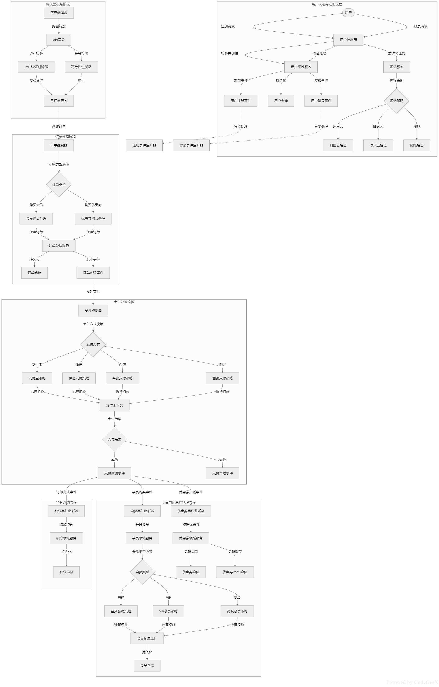

# 服务器环境配置
[docker-config](docker-config)
整合使用docker compose

# 项目结构介绍

## sharding公共模块
[aide-sharding-sdk](aide-sharding-sdk)
自定义hash桶+动态扩容（服务按照需要导入，可在服务中重写分片逻辑）
（服务按照需要导入，可在服务中重写分片逻辑）

## 获取用户信息公共模块
[auth-api](auth-api)
获取用户信息
（服务按照需要导入，可在服务中重写分片逻辑）

## 公共模块
[common-api](common-api)
返回值
全局异常
openfeign调用api需要的对象
（服务按照需要导入，可在服务中重写分片逻辑）
...

## 网关
[gateway](gateway)
验证token
缓存
校验用户（可动态踢出用户登录）
防重校验
...

## 会员模块
[member](member)
购买会员
...

## 资金模块
[money](money)
充值
扣款
...

## 订单模块
[order](order)
下单
    sentinel+opfeign+MQ
    限流，远程调用，异步处理后续逻辑
付款后更改订单状态
    （第三方支付：直接更改订单状态，然后MQ送积分，续费会员等等，和余额支付：改状态+扣款在一个seata事务中，然后MQ处理订单等）
...

## 用户模块
[user](user)
登录
注册
绑定手机号
上传头像
创建缓存，生成token
...

## 优惠券模块
[coupon](coupon)
优惠券创建
优惠券库存预热（使用XXL-JOB）
优惠券发布（预热）
    （未做，可用于优惠券抢购开始事件调用，这边使用XXL-JOB）
优惠券领取->mq创建订单

# 流程

